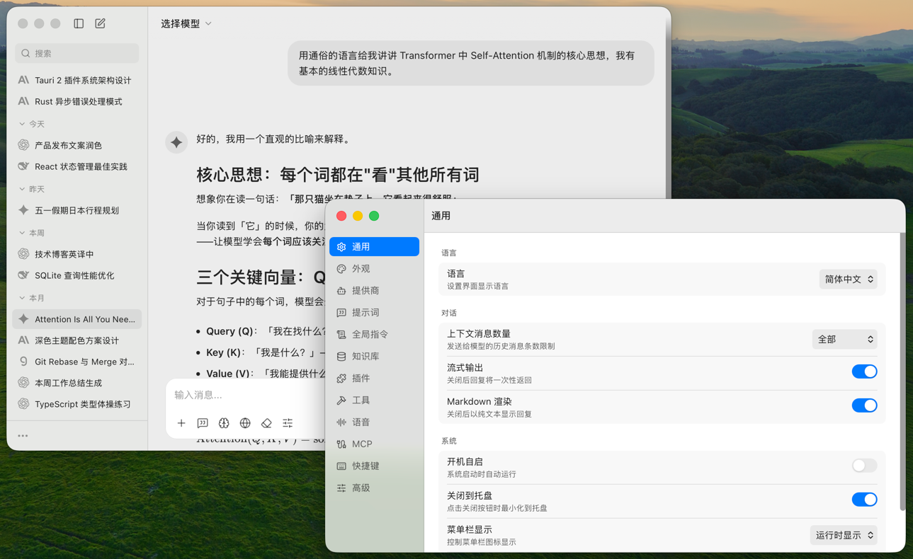

# ChatNeo

一款跨平台 AI 聊天客户端，使用 Tauri V2 + React 构建，支持 28+ AI 服务提供商。

> [!WARNING]
> ChatNeo 目前还处于早期阶段，可能会出现一些 bug。



## 特性

- **多提供商** - OpenAI / Anthropic / Gemini / DeepSeek / Groq / xAI / Mistral / 硅基流动 / Kimi / 智谱 / 火山引擎 / Ollama 等 28+ 提供商，支持任意 OpenAI 兼容端点
- **流式对话** - Markdown / 代码高亮 / LaTeX / Mermaid 渲染
- **多模型对比** - 同时向多个模型提问，对比回答
- **深度思考** - 支持 o1/o3、Claude thinking、Gemini thinking 等扩展推理
- **视觉理解** - 图片输入与分析
- **语音交互** - Whisper 语音输入 + TTS 语音朗读
- **内置工具** - 网页搜索、网页阅读、文件解析、计算器、代码运行等
- **MCP 协议** - 连接外部工具服务
- **知识库 (RAG)** - 本地向量化知识库，支持 PDF / Word / URL 等文档
- **图片/视频生成** - 支持 OpenAI / Google / xAI 等平台
- **数据管理** - 对话导出 (PDF/Markdown/Word)、截图、备份恢复、WebDAV 云同步
- **本地存储** - SQLite 本地数据库，保护隐私
- **多语言** - 中文 / English
- **主题** - 亮色 / 暗色，自定义主题色，macOS 毛玻璃效果

## 下载安装

前往 [Releases](https://github.com/0xxb/chatneo-releases/releases) 页面下载最新版本：

| 平台 | 安装包 |
|------|--------|
| macOS (Apple Silicon) | `.dmg` |
| macOS (Intel) | `.dmg` |
| Windows | `.exe` |
| Linux | `.deb` / `.AppImage` |

### macOS 用户须知

由于应用未签名，安装后需要在终端执行以下命令移除安全限制：

```shell
xattr -cr /Applications/ChatNeo.app
```

## 反馈

如有问题或建议，请在 [Issues](https://github.com/0xxb/chatneo-releases/issues) 中提交。
